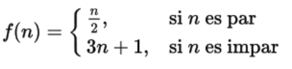

g. Considere que se aplica la siguiente función de forma recursiva. A partir de un número n positivo se obtiene una sucesión que termina en 1:

Por ejemplo, para n= 6, se obtiene la siguiente sucesión:
    f(6) = 6/2 = 3
    f(3) = 3*3 + 1 = 10
    f(10) = 10/2 = 5
    ….

Es decir, la sucesión 6, 3, 10, 5, 16, 8, 4, 2, 1. Para cualquier n con el que se arranque
siempre se llegará al 1.

    ■ Escriba un programa recursivo que, a partir de un número n, devuelva una lista con cada miembro de la sucesión.
    
public class EjercicioSucesion {
    public List<Integer> calcularSucesion (int n) {
        //código
    }
}
