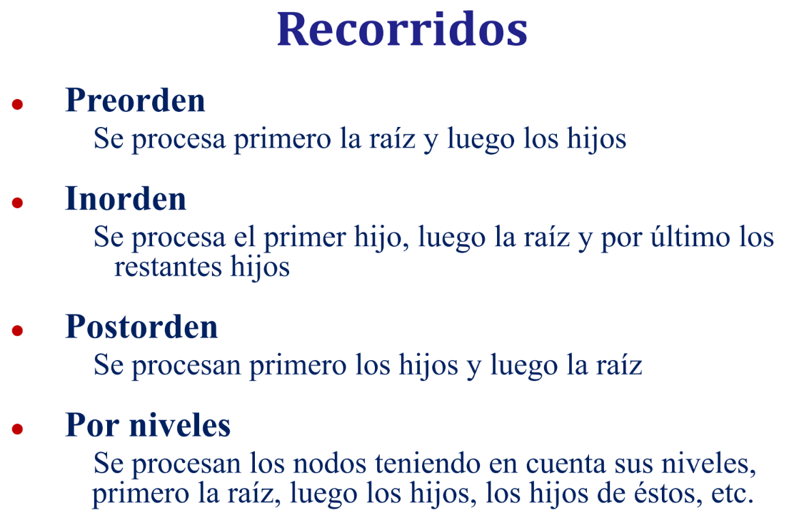
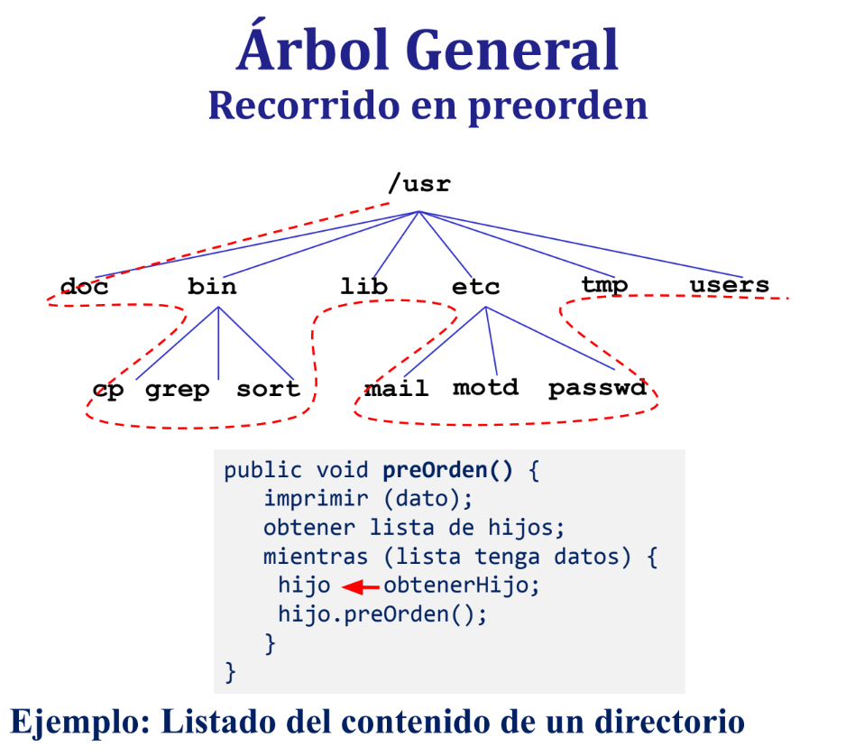
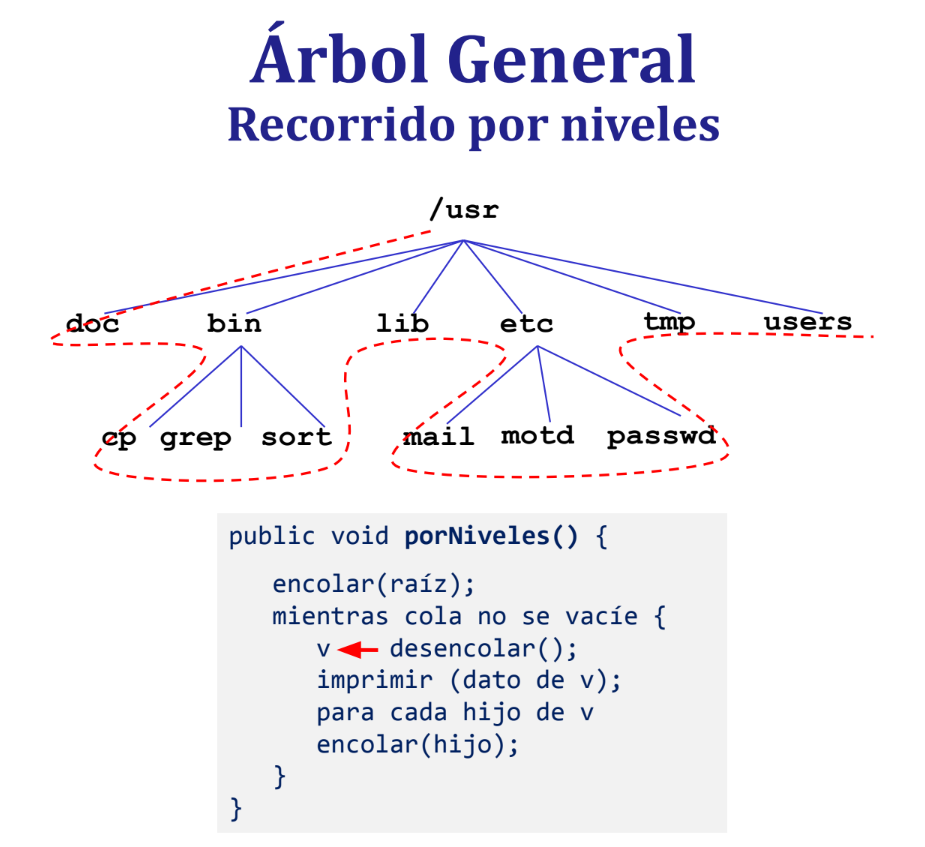

# Ejercicio 2
a) Implemente en la clase RecorridosAG los siguientes métodos:

public List<Integer> numerosImparesMayoresQuePreOrden (GeneralTree <Integer> a, Integer n)
    Método que retorna una lista con los elementos impares del árbol “a” que sean mayores al valor “n” pasados como parámetros, recorrido en preorden.

public List<Integer> numerosImparesMayoresQueInOrden (GeneralTree <Integer> a, Integer n)
    Método que retorna una lista con los elementos impares del árbol “a” que sean mayores al valor “n” pasados como parámetros, recorrido en inorden.

public List<Integer> numerosImparesMayoresQuePostOrden (GeneralTree <Integer> a, Integer n)
    Método que retorna una lista con los elementos impares del árbol “a” que sean mayores al valor “n” pasados como parámetros recorrido en postorden.

public List<Integer> numerosImparesMayoresQuePorNiveles(GeneralTree <Integer> a, Integer n)
    Método que retorna una lista con los elementos impares del árbol “a” que sean mayores al valor “n” pasados como parámetros, recorrido por niveles.
