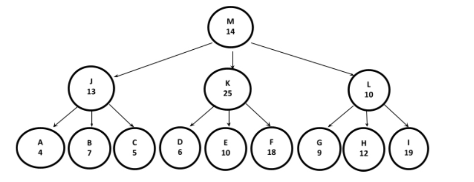

# Ejercicio 4
El esquema de comunicación de una empresa está organizado en una estructura jerárquica, en donde cada nodo envía el mensaje a sus descendientes. Cada nodo posee el tiempo que tarda en transmitir el mensaje.

Se debe devolver el mayor promedio entre todos los valores promedios de los niveles. Para el ejemplo presentado, el promedio del nivel 0 es 14, el del nivel 1 es 16 y el del nivel 2 es 10. Por lo tanto, debe devolver 16.
  
  a) Indique y justifique qué tipo de recorrido utilizará para resolver el problema.
        - Como tengo que retornar un resultado que viene de analizar cada nivel individual, tengo que hacer un recorrido por niveles.
  
  b) Implementar en una clase AnalizadorArbol, el método con la siguiente firma:

public int devolverMaximoPromedio (GeneralTree<AreaEmpresa>arbol)

Donde AreaEmpresa es una clase que representa a un área de la empresa mencionada y que contiene la identificación de la misma representada con un String y una tardanza de transmisión de mensajes interna representada con int.
