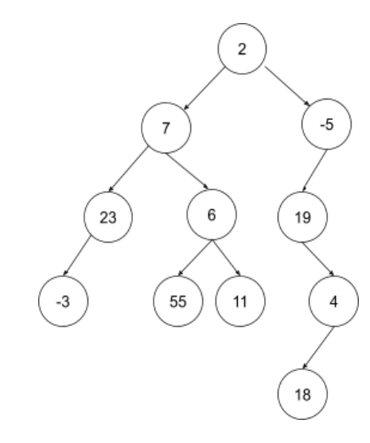

Los siguientes ejercicios fueron tomados en parciales, en los últimos años. Tenga en cuenta que:
    1. No puede agregar más variables de instancia ni de clase a la clase ParcialArboles.
    2. Debe respetar la clase y la firma del método indicado.
    3. Puede definir todos los métodos y variables locales que considere necesarios.
    4. Todo método que no esté definido en la sinopsis de clases debe ser implementado.
    5. Debe recorrer la estructura solo 1 vez para resolverlo.
    6. Si corresponde, complete en la firma del método el tipo de datos indicado con signo de “?”.
# Ejercicio 7

Escribir en una clase ParcialArboles que contenga UNA ÚNICA variable de instancia de tipo BinaryTree de valores enteros NO repetidos y el método público con la siguiente firma: public boolean isLeftTree (int num)
El método devuelve true si el subárbol cuya raíz es “num”, tiene en su subárbol izquierdo una cantidad mayor estricta de árboles con un único hijo que en su subárbol derecho. Y false en caso contrario. Consideraciones:
● Si “num” no se encuentra en el árbol, devuelve false.
● Si el árbol con raíz “num” no cuenta con una de sus ramas, considere que en esa rama hay -1 árboles con único hijo.

Por ejemplo, con un árbol como se muestra en la siguiente imagen:

Si num = 7 devuelve true ya que en su rama izquierda hay 1 árbol con un único hijo (el árbol con raíz 23) y en la rama derecha hay 0. (1 > 0) → true
Si num = 2 devuelve false, ya que en su rama izquierda hay 1 árbol con único hijo (árbol con raíz 23) y en la rama derecha hay 3 (árboles con raíces -5, 19 y 4). (1 > 3) → false)
Si num = -5 devuelve true, ya que en su rama izquierda hay 2 árboles con único hijo (árboles con raíces 19 y 4) y al no tener rama derecha, tiene -1 árboles con un único hijo. (2 > -1) → true
Si num = 19 debería devolver false, ya que al no tener rama izquierda tiene -1 árboles con un único hijo y en su rama derecha hay 1 árbol con único hijo. (-1 > 1) → false
Si num = -3 debería devolver false, ya que al no tener rama izquierda tiene -1 árboles con un único hijo y lo mismo sucede con su rama derecha. (-1 > -1 ) → false