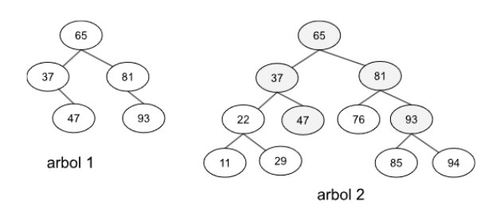
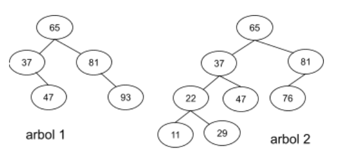
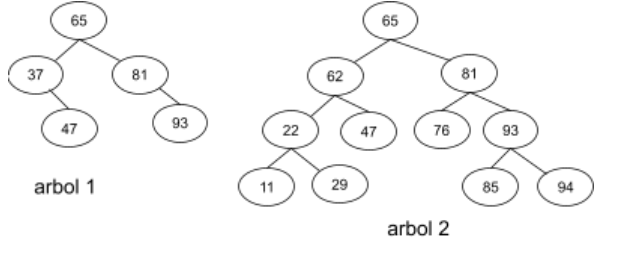

# Ejercicio 8

Escribir en una clase ParcialArboles el método público con la siguiente firma:
public boolean esPrefijo(BinaryTree<Integer> arbol1, BinaryTree<Integer> arbol2)

El método devuelve true si arbol1 es prefijo de arbol2, false en caso contrario.

Se dice que un árbol binario arbol1 es prefijo de otro árbol binario arbol2, cuando arbol1 coincide con la parte inicial del árbol arbol2 tanto en el contenido de los elementos como en su estructura. Por ejemplo, en la siguiente imagen: arbol1 ES prefijo de arbol2.

En esta otra, arbol1 NO es prefijo de arbol2 (el subárbol con raíz 93 no está en el árbol2)

En la siguiente, no coincide el contenido. El subárbol con raíz 37 figura con raíz 62, entonces arbol1 NO es prefijo de arbol2.
